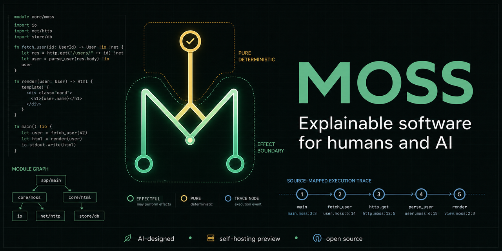

<p align="center">
  
</p>

# Moss language prototype


Moss is an experimental programming language for long-lived software projects
where humans and AI agents work on the same codebase over time.

This repository is intentionally AI-built: Moss was designed, implemented,
debugged, documented, committed, and pushed by DeepSeek in collaboration with
Fujo930. The project is public as a record of that process and as a runnable
language prototype.

Version `0.5.0` completes the first developer-experience roadmap with a language
server, TextMate grammar, golden output tests, generated API docs, and richer
Studio project and self-host controls. Moss is not fully self-hosted yet, but
its Moss-written frontend is declared, checked, tested, and compared as a Moss
project.

The branching M is Moss's language mark: two contributors meeting in a shared
syntax tree. See `docs/identity.md` for the public description and identity
rules.

## Quick start

Windows users can download the standalone compiler, language server, and Studio
from the [`v0.5.4` release](https://github.com/Fujo930/moss-lang/releases/tag/v0.5.4).
Choose the installer or portable ZIP; neither requires a separate Python
installation.

From this folder:

```powershell
python -m pip install -e .
moss check examples/order.moss
moss run examples/order.moss
moss test examples/order.moss
moss format --check examples/order.moss
moss selfhost
moss selfhost --quick
moss selfhost-compare examples
moss golden examples/order.moss
moss docs examples/order.moss
moss repl
moss studio
```

You can also run without installing:

```powershell
python -m mosslang.cli run examples/order.moss
```

To build local release artifacts:

```powershell
python -m pip install build
python -m build
```

To build the standalone Windows compiler, Studio, and installer:

```powershell
powershell -ExecutionPolicy Bypass -File packaging/build_windows.ps1
```

The Windows installer includes its own runtime, adds an optional `moss` PATH
entry, creates Moss Studio shortcuts, and uses `Documents/Moss Workspace` as
the editable Studio workspace.

The package exposes a console command named `moss`.

## What works now

- `effect` declarations
- `type` declarations for records and simple unions
- `rule` declarations as pure expression functions
- `fn` declarations with optional `uses EffectName`
- `test "name" { ... }` blocks for language-level executable checks
- records, record field access, and record updates
- `if`, `else if`, and `else` blocks
- list literals, indexing, `for` loops, `len`, `listPush`, `listGet`,
  `listSet`, `listSlice`, `listConcat`, `listInsert`, `listRemove`, and
  `range`
- `Map<K, V>` through `mapNew`, `mapPut`, `mapGet`, `mapHas`, `mapKeys`,
  `mapValues`, and `mapRemove`
- `while`, `break`, and `continue`
- Text helpers: `textChars`, `textJoin`, `textSplit`, `textTrim`, `textSlice`,
  `textContains`, `textIndexOf`, `textReplace`, `textStartsWith`, and
  `textEndsWith`
- deterministic JSON parsing and serialization through `jsonParse` and
  `jsonStringify`
- explicit `Network` effect adapters through `httpGet` and `httpPostJson`
- `FileSystem` effect builtins: `readText`, `writeText`, `fileExists`, and
  `listFiles`
- top-level `import "path.moss"` declarations
- `moss.toml` manifests, deterministic import graphs, and declared source roots
- deterministic `moss.lock` files with module content hashes
- project initialization, inspection, checking, running, and testing commands
- project-wide checks for missing imports, cycles, and declaration conflicts
- editor diagnostics, symbols, and semantic tokens through `moss-lsp`
- TextMate syntax highlighting through `editors/moss.tmLanguage.json`
- golden output checking and updating through `moss golden`
- generated Markdown API and schema references through `moss docs`
- Studio project graphs, declaration symbols, traces, and host/self-host
  comparison controls
- self-hosting sketches with structured token records, reusable lexer/parser
  cores, structured expression and recursive control-flow statement AST nodes,
  a top-level declaration parser, and a first checker sketch:
  `examples/self_host/tokenizer_sketch.moss` and
  `examples/self_host/expression_sketch.moss` and
  `examples/self_host/statement_sketch.moss` and
  `examples/self_host/parser_sketch.moss` and
  `examples/self_host/checker_sketch.moss`
- `moss selfhost`, which runs the tokenizer/parser/checker sketches plus
  `examples/self_host/project_check.moss`; the project check parses and checks
  the self-hosting Moss files with Moss code
- nullary and payload variants such as `Paid` and `ShipError.NotReady(Pending)`
- `match` expressions with wildcard and payload binding patterns
- `Result` values with `Ok(...)`, `Err(...)`, and `?`
- `require condition else value`, which returns `Err(value)` from `Result`
  functions
- runtime type contracts for function arguments and return values
- conservative static inference for local bindings, assignments, calls, returns,
  and list element types
- static record-field access/update checks and exhaustive union `match` checks
- flow-sensitive branch inference and payload-aware union pattern checks
- expression-located diagnostics and complete host/self-host expression AST comparison
- `List<T>`, `Map<K, V>`, and `Option<T>` runtime type contracts
- a tiny in-memory database through `dbPut` and `dbGet`, guarded by the
  `Database` effect inside functions

## Example

```moss
effect Database

type Order =
  id: Text
  status: Pending | Paid | Shipped | Cancelled
  total: Money

type ShipError = NotReady | Missing

rule canShip(order: Order) -> Bool =
  order.status == Paid and order.total > 0.usd

fn ship(order: Order) -> Result<Order, ShipError> uses Database {
  require canShip(order)
    else ShipError.NotReady(order.status)

  updated = order with status = Shipped
  dbPut(order.id, updated)

  return Ok(updated)
}

let order = { id: "A-100", status: Paid, total: 42.usd }
let shipped = ship(order)?
print("status:", shipped.status)
print("stored:", dbGet("A-100").status)
```

## Commands

```powershell
moss check <file.moss>
moss check --json <file.moss>
moss project-check <directory>
moss project-check --json <directory>
moss project-info <directory>
moss project-info --json <directory>
moss project-lock <directory>
moss project-format <directory>
moss project-format --check <directory>
moss project-run <directory>
moss project-test <directory>
moss project-init <directory> [--name <package-name>]
moss run <file.moss>
moss test <file.moss>
moss tokens <file.moss>
moss ast <file.moss>
moss trace <file.moss>
moss trace --json <file.moss>
moss golden <file.moss>
moss golden --update <file.moss>
moss docs <file.moss> [--output <path>]
moss format <file.moss>
moss format --check <file.moss>
moss selfhost
moss selfhost --quick
moss selfhost-compare examples
moss repl
moss studio
moss-lsp
```

`moss studio` opens a local HTTP editor at `http://127.0.0.1:8765`.

`moss check --json` emits stable machine-readable diagnostics, source
locations, and a declaration summary for CI, editors, and AI agents.

`moss project-check` recursively checks every `.moss` file in a directory and
returns an aggregate project health result.
When it finds a `moss.toml`, it follows the entry module's reachable import
graph and performs an additional package-wide static check.

`moss project-info` exposes the deterministic module graph for humans, CI, and
AI agents. `moss project-run` and `moss project-test` run the manifest entry
with its declared source roots. `moss project-init` creates a minimal runnable
project.

`moss project-lock` writes the current module graph and SHA-256 source hashes to
`moss.lock`. Use `moss project-check --locked`, `moss project-run --locked`, or
`moss project-test --locked` in CI when project drift must be explicit.

`moss project-format` formats only modules reachable from the manifest entry.
Its `--check` mode is a deterministic CI formatting gate.

`moss format` normalizes block indentation, expression spacing, trailing
whitespace, and the final newline while preserving strings and comments.
`--check` makes it suitable for CI.

`moss trace` executes a program while recording every `rule` evaluation,
including arguments, result, source file, line, and column. Its JSON form is a
stable input for audit tools and AI agents.

`moss golden` compares program output with a neighboring `.golden` file.
`moss golden --update` records an intentional new result.

`moss docs` generates a Markdown reference from effects, records, unions,
rules, functions, parameters, return types, and declared effects.

`moss-lsp` starts the stdio language server used by compatible editors. It
publishes diagnostics and exposes document symbols and semantic tokens.

`moss selfhost --quick` runs the fast self-hosting sketches. `moss selfhost`
also runs the slower Moss-written project check over `examples/self_host`.
`moss selfhost-compare examples` compares Python-host and Moss-written parser
declarations, metadata, recursive statement shapes, and complete recursive
expression and match-pattern ASTs across all root example programs.

## Project status

This is version `0.5.0`: a compact interpreter with real syntax, runtime
semantics, deterministic project tooling, editor integrations, a browser
workbench, and a verified Moss-written frontend.
The repository is released under the MIT License.

Suitable claims:

- Moss is AI-designed and AI-built.
- Moss can run useful example programs today.
- Moss has begun self-hosting.
- Moss is still alpha software and should not be described as fully self-hosted.

The 0.6 milestone focuses on a five-minute first-run experience, a VS Code
extension, hosted playground, cross-platform releases, and a controlled
`Process` effect for existing Python, Node, and command-line tools. Typed Python
FFI begins as a 0.7 prototype; stable Python and Node bindings belong to 0.8
after their effect and type boundaries are proven.

GitHub's language bar is powered by Linguist. `.moss` files are marked
detectable in `.gitattributes`, but GitHub will only show `Moss` as a first-class
language after Moss is accepted into the upstream Linguist language list.

See `docs/language.md` for the current language surface,
`docs/projects.md` for manifests and project commands,
`docs/studio.md` for the browser editor,
`docs/tooling.md` for editor and developer tooling,
`docs/ecosystem.md` for adoption and external-language compatibility strategy,
`docs/grove.md` for the planned Moss-native open-source editor,
`docs/history.md` for a commit-by-commit feature guide, and
`docs/roadmap.md` for the path from prototype to a serious implementation.
See `docs/release-0.5.md` for the current release notes and packaging checklist,
and `docs/identity.md` for the Moss identity.

## Participate

Moss `0.5.0` is ready for early technical feedback, especially from people
interested in programming-language design, self-hosting, explicit effects, and
human/AI software maintenance.

- Read `CONTRIBUTING.md` for approachable first contributions.
- Use GitHub Issues for reproducible bugs, focused proposals, and platform
  installation reports.
- Read `docs/ecosystem.md` for the adoption and external-language strategy.
