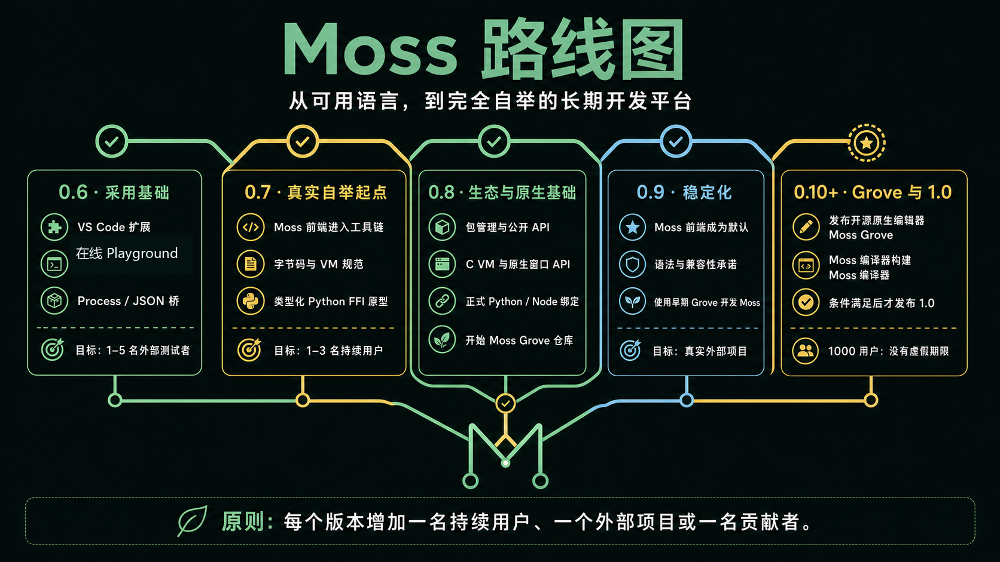
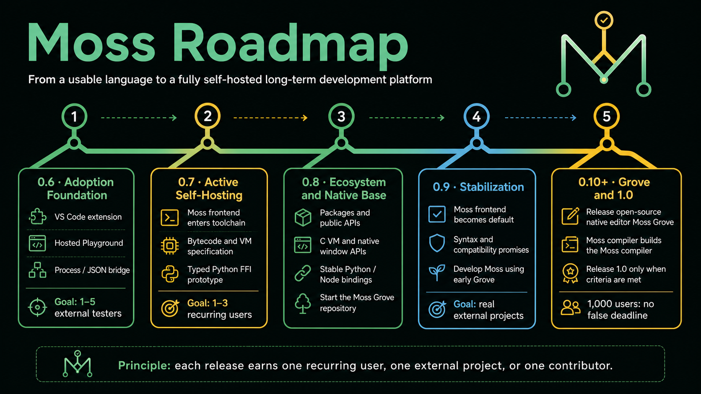

# Moss roadmap

Moss is an AI-designed and AI-built language prototype. Codex has designed,
implemented, repaired, documented, committed, and pushed the current repository
in collaboration with Fujo930. Development on the ds-Mosslang branch is
continued by Reasonix as of 0.5.5.

## Version 0.5.7: trust bundles

Implemented:

- `moss trust <file.moss>` — unified trust bundle combining check, trace,
  golden, and selfhost comparison into a single JSON artifact
- trust bundle exit code: 0 = all gates passed, 1 = at least one failure
- `moss trust --output path.json` writes bundle to file
- `moss repl` and `moss selfhost-compare` fully migrated to VM
- 2 trust bundle tests; 118 tests, 9 subtests pass

## Version 0.5.6: VM execution unified

Implemented:

- `moss trace`, `moss golden`, `moss project-run`, `moss project-test`,
  `moss selfhost` switched to bytecode VM
- short-circuit `and`/`or` compilation (jump-based, matching Runtime semantics)
- `textJoin(parts)` single-argument support with correct `(parts, sep)` order
- VM `import_paths` support for multi-root projects
- imported module test block merging in `_load_imports`
- `CodeObject.is_rule` flag for rule detection at runtime
- `CodeObject.source_line`/`source_column` for source-mapped traces
- `moss trace` rule evaluation events on VM with file/line/column
- 116 tests pass; selfhost 5/5 sketches pass

`moss repl` and `moss selfhost-compare` remain on Runtime pending API
refactoring (0.5.7).

## Version 0.5.5: backtick interpolation and VM default

Implemented:

- backtick string literals with `{expr}` interpolation
- `moss run` and `moss test` switched to bytecode VM as default execution engine
- `TestDecl` compilation into callable bytecode `CodeObject` entries
- `BytecodeModule.tests` list in `.mbc` binary format
- module-level `let` variables accessible from functions and test blocks
- mixed-type string coercion for `+` operator in the VM
- tokenizer backtick collection mode with `BK_PART`/`INTERP_START`/`INTERP_END` tokens
- `|>` pipe operator token added to tokenizer
- 8 new backtick interpolation tests; 116 total tests pass

## Visual roadmap

Chinese:

English:

## Version 0.1: executable sketch

Implemented:

- tokenizer, parser, AST, interpreter
- `effect`, `type`, `rule`, and `fn`
- record values and record updates
- variants and namespaced variants
- `Result`, `?`, and `require`
- `match` expressions
- top-level `test` blocks and `moss test`
- lists, indexing, `for` loops, and list helper builtins
- `Map<K, V>` and map helper builtins
- `while`, `break`, `continue`, and `else if`
- Text helpers and `FileSystem` effect builtins
- top-level file imports
- `Option<T>` type contracts and safe list helpers
- first Moss-written tokenizer sketch with structured token records
- first Moss-written line parser sketch
- first Moss-written checker sketch
- effect checking for the built-in database capability
- runtime type contracts
- CLI commands: `check`, `run`, `tokens`, `ast`
- browser editor through `moss studio`
- tests and examples

## Version 0.2: self-hosting preview

Implemented:

- `moss selfhost --quick` for fast self-hosting smoke checks
- `moss selfhost` for the full Moss-written self-host project check
- Moss-written project checker with project-wide type-name collection
- structured Moss-written expression and simple statement AST parsers
- host/self-host declaration count and name comparison across bundled examples
- self-host checker coverage for duplicate declarations, duplicate record
  fields, import paths, parse errors, undeclared effects, record field types,
  function parameter and return types, and rule parameter and return types
- text helpers needed by compiler code: `textIndexOf` and `textReplace`
- release metadata for a public alpha package as `0.2.0`
- branching M language identity and a refreshed, denser Moss Studio

This version is public-ready as an alpha. It should be described as
"self-hosting started" or "self-hosting preview", not "fully self-hosted".

## Version 0.3: static confidence

Implemented:

- recursive Moss-written `if`/`else`, `for`, and `while` statement AST nodes
- structured `break` and `continue` statements in the Moss-written frontend
- host/self-host recursive function and test body statement-shape comparison
- host/self-host record field, alias, parameter, return type, and effect
  metadata comparison
- structured source locations in checker, CLI, and Studio diagnostics
- expression-level source locations for static type diagnostics
- conservative, idempotent `moss format` and CI-oriented `moss format --check`
- canonical expression operator, comma, and colon spacing
- conservative local-binding and expression type inference
- static callable argument, return, record-field access, and record-update checks
- exhaustive union `match` checks and duplicate-case warnings
- union membership, declared payload arity, and unreachable match-case checks
- flow-sensitive type merging across complete `if`/`else` branches
- machine-readable `moss check --json` diagnostics and summaries
- recursive text and JSON project checking through `moss project-check`
- persistent multiline interactive sessions through `moss repl`
- Moss-written structured `match` expressions and recursive patterns
- host/self-host complete recursive expression and match-pattern AST comparison

Version 0.3 feature work is complete. Remaining work belongs to the 0.4
product-engineering track or the longer self-hosting replacement track.

## Version 0.4: product engineering workflow

Make Moss feel like a language for real systems:

- module imports with deterministic project graphs
- package manifests with entry modules and source roots
- project initialization, inspection, checking, running, and testing
- reachable-module project formatting and CI format checks
- project-wide checks for missing imports, cycles, and declaration conflicts
- deterministic project lock files with module content hashes
- JSON adapter with deterministic serialization
- explicit `Network` effect HTTP GET and JSON POST adapters
- source-mapped rule evaluation traces through `moss trace`

The implemented 0.4 product-engineering scope is complete. Schema migration
declarations, user-defined capability implementations, stronger module
boundaries, and external package dependencies remain future work.

## Version 0.5: editor and playground

Developer experience:

- TextMate syntax highlighting grammar
- stdio language server diagnostics, symbols, and semantic tokens
- source-located Studio diagnostics, symbols, project graphs, traces, and
  host/self-host comparison controls
- reusable JSON Studio API shape ready for a hosted browser playground
- test runner with golden output files
- generated Markdown API and schema docs

Version 0.5 feature work is complete.

**ds-Mosslang 0.5.1–0.5.4** (DeepSeek fork): adds bytecode compiler + stack VM
(32-opcode ISA, .mbc binary format), token-efficient syntax (implicit return,
pipe `|>`, lambda `\`, arrow body `fn f(x) = expr`), and full self-host
project support (`project_check.moss` runs 0 errors). All 108 tests pass.

## Version 0.6: adoption and integration foundation

Make a stranger productive with Moss in five minutes:

- official VS Code extension bundling the TextMate grammar and `moss-lsp`
- hosted browser playground using the existing Studio JSON API shape
- `moss new` templates for rule services, CLI tools, and libraries
- actionable diagnostics with suggested fixes
- cross-platform release automation for Windows, macOS, and Linux
- reusable GitHub Actions workflow
- five-minute tutorial and a realistic explainable business-rules showcase
- explicit `Process` effect for controlled external commands
- deterministic JSON request/response convention for Python, Node, and other
  subprocess integrations

The external-process bridge is an integration boundary, not the final FFI. It
lets Moss reuse existing ecosystems without silently weakening its type and
effect model.

Implemented in the first 0.6 development batch:

- explicit, no-shell `Process` effect through `processRun`
- deterministic JSON subprocess bridge through `processRunJson`
- `moss new` with basic, rules, CLI, and library templates
- cross-platform GitHub Actions checks on Windows, macOS, and Linux

Version 0.6 is not released yet. VS Code integration, the hosted playground,
diagnostic fixes, release automation, tutorials, and the showcase remain.

## Version 0.7: active self-host frontend and typed FFI prototype

Move verified Moss-written compiler work into the real toolchain:

- selectable Python-host and Moss-written frontend modes
- differential tests and compatibility gates for both frontends
- Moss-written tokenizer and parser used by real compiler commands
- expand the Moss-written checker and improve self-host performance
- define the Moss FFI model, type mapping, failures, and effect boundaries
- prototype typed Python bindings under an explicit `Python` effect
- generate Moss declarations from selected Python modules

The Python prototype should expose declared, typed bindings rather than
arbitrary Python objects.

## Version 0.8: packages and external ecosystems

Let projects safely reuse Moss and host-language libraries:

- package dependency resolution and deterministic package locks
- module visibility and explicit public APIs
- package registry prototype and documentation site
- standard-library versioning and compatibility policy
- schema migration declarations and user-defined capability implementations
- stable `moss bind python <module>` workflow
- Python functions, selected classes, async calls, and exception mapping
- typed Node/JavaScript bindings under an explicit `JavaScript` effect
- extension protocol for future host-language adapters
- design the native window, rendering, input, editor, and extension APIs needed
  by Moss Grove

Python is the first official FFI because the current runtime can integrate it
with the smallest trusted boundary. Node follows after the binding model is
proven. Moss Grove begins as a separate public repository during this milestone
once those native API contracts have an executable foundation.

## Version 0.9: language stabilization

- freeze the core syntax and publish a complete language specification
- define source and package compatibility guarantees
- make the self-host frontend the default
- improve performance, security boundaries, sandboxing, and benchmarks
- validate Moss with larger projects maintained by multiple contributors
- use an early Moss Grove build while developing and stabilizing Moss

## Version 0.10: Moss Grove

Build and release a Moss-native development environment as an independent,
public, MIT-licensed open-source project:

- repository: `Fujo930/moss-grove`
- editor core, project model, commands, and extension host written in Moss
- small C platform layer for native windows, rendering, input, file watching,
  clipboard, process launching, and operating-system integration
- no required browser, Node, Electron, or Python runtime
- multi-file editing, tabs, project tree, global search, command palette, and
  workspace restore
- diagnostics, completion, hover, definition, references, rename, formatting,
  tests, debugging, and source-mapped rule traces
- visual effect, type, module-dependency, and call graphs
- self-host compiler status and differential-test views
- Python and Node binding inspection
- stable plugin API with structured commands that humans and AI agents can use

Studio remains the lightweight browser playground, and the VS Code extension
remains the lowest-friction integration for existing users. Grove is the
complete Moss-native environment and a serious proof that Moss can maintain a
large, long-lived application.

Grove belongs in its own repository so its release cadence, issues, extensions,
and contributors can grow independently from the compiler. The `moss-lang`
repository owns language, compiler, VM, LSP, and shared protocol contracts;
`moss-grove` owns the native editor product.

## Version 1.0: trustworthy commitment

Release 1.0 only after the core language is stable, the self-host compiler path
is reliable, installation works across supported platforms, compatibility
policy is enforceable, and people outside this repository have completed real
projects with Moss. Moss Grove must also demonstrate that Moss can sustain a
substantial native application. If these criteria are not met after 0.10,
development continues through later `0.x` releases instead of forcing 1.0.

## Adoption and ecosystem strategy

Moss should earn users through a distinctive capability, not novelty alone.
Its public design center is explainable business rules, explicit effects, and
deterministic project surfaces that humans and AI agents can inspect together.

Near-term success is measured by successful first runs, editor installs,
external projects, issues, and contributions rather than stars alone. The
ecosystem priority order is editor and installation quality, tutorials and
showcases, CI integration, a dependable standard library, then a package
registry after module APIs and compatibility rules are stable.

## Research track

The bigger language questions:

- Can business rules compile to explainable traces by default?
- Can schema evolution be represented as first-class code?
- Can effects stay explicit without creating annotation fatigue?
- Can concurrency be structured around product workflows rather than raw tasks?
- Can typed host-language bindings preserve explainability and deterministic
  review boundaries?
